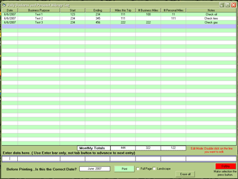



## Mileage Log \(updated 6\-11\-2007\)

### Description

This is my first attempt at using the msflexgrid, so the code may not be the best. Who knows, this app may be just what you are looking for. As always, comments and suggestions are welcome.(Yes I know a database would probably be nicer, but I'm learning something new)

Updated:Improved printout and some code tweaks.

Update:added MPG calculator and fixed bugs.
 
### More Info
 

             |
---                |---
**Submitted On**   |2007-06-10 17:05:38
**By**             |[Kenneth Foster](https://github.com/Planet-Source-Code/PSCIndex/blob/master/ByAuthor/kenneth-foster.md)
**Level**          |Intermediate
**User Rating**    |4.8 (24 globes from 5 users)
**Compatibility**  |VB 6\.0
**Category**       |[Miscellaneous](https://github.com/Planet-Source-Code/PSCIndex/blob/master/ByCategory/miscellaneous__1-1.md)
**World**          |[Visual Basic](https://github.com/Planet-Source-Code/PSCIndex/blob/master/ByWorld/visual-basic.md)
**Archive File**   |[Mileage\_Lo2070316112007\.zip](https://github.com/Planet-Source-Code/kenneth-foster-mileage-log-updated-6-11-2007__1-68764/archive/master.zip)

